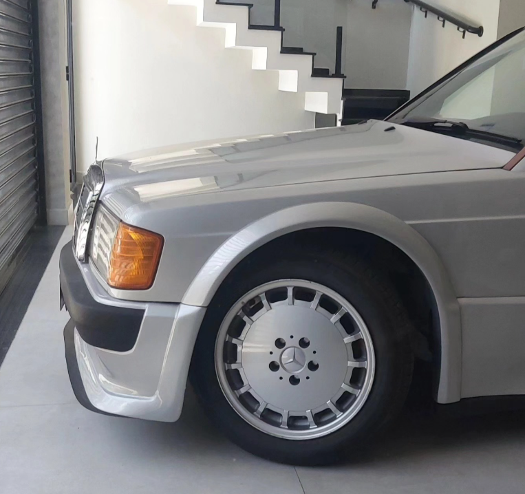
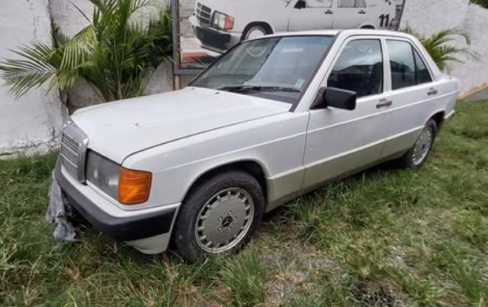
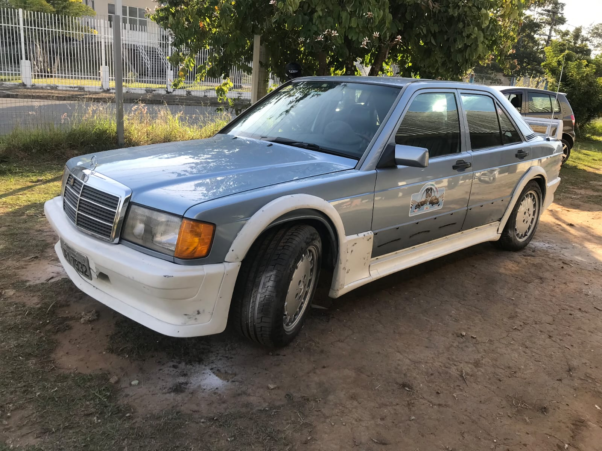
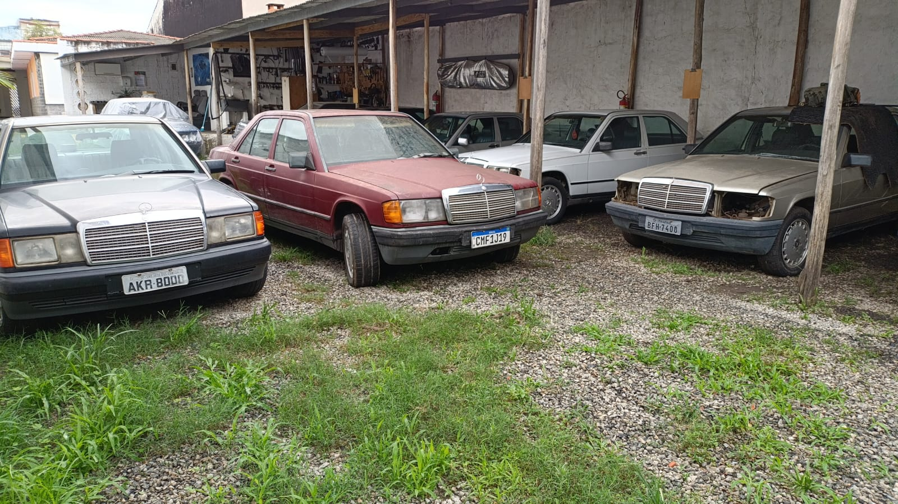

# 747 Garage

Vitrine web da 747 Garage, focada em Mercedes clássicas dos anos 80 e 90, com catálogo de veículos, peças, serviços especializados e fluxo de reserva.

## Preview



<p align="center">
	
	
	
</p>

## Destaques do projeto

- Landing page com identidade visual autoral e animações.
- Catálogo de veículos com galeria de fotos e páginas individuais.
- Catálogo de peças com filtros, ordenação e paginação.
- Catálogo de serviços com foco em restauração e instalação.
- Formulário de reserva com validação e proteção de segurança.
- Páginas de tratamento de erro e 404 customizadas.

## Stack

- Next.js 16 (App Router)
- React 19 + TypeScript
- Tailwind CSS
- Prisma + SQLite
- Zod (validação)

## Segurança aplicada

- Validação de payload no backend.
- Sanitização de campos de entrada.
- Proteção CSRF com cookie + header.
- Rate limit por IP.
- Verificação de origem confiável.
- Honeypot anti-bot no fluxo de reserva.
- Headers de segurança e CSP via middleware.

Mais detalhes em [SECURITY.md](SECURITY.md).

## Estrutura principal

```text
app/
	page.tsx
	vehicles/
	pecas/
	servicos/
	api/
components/
lib/
prisma/
public/
```
## Autor

Projeto desenvolvido para apresentação de portfólio da 747 Garage.


